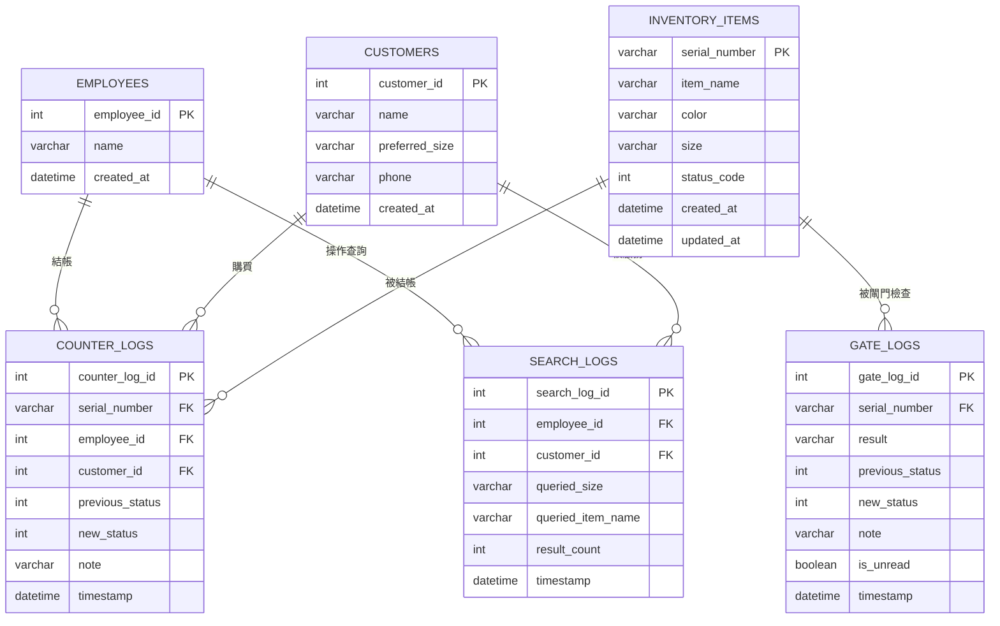

# 第五版本 E｜系統架構與設計文件（最終版）

> 單件流水號倉庫系統 ＋ 員工 ＋ 會員 ＋ 尺寸 ＋ 查詢紀錄。
> 情境：零售門市的 RFID 防盜系統，加上會員制。

---

## 一、系統總覽

這套系統模擬一間「會員制 + RFID 防盜」的零售門市。

- **操作者只有店員（員工）**：所有後台動作（建立資料、查詢、結帳）都由員工執行。
- **會員是被服務、被結帳的對象**，本身不操作系統。
- **每一件商品都是獨立單品**，擁有自己的流水號（`SN-000001`…）與尺寸。
- **閘門是防盜關卡**：只有正常結帳過的商品才能合法通過，否則判定為未授權（疑似偷竊）。

系統一共有 **6 張資料表**：

| 表 | 角色 | 性質 |
|---|---|---|
| `employees` | 員工 | 實體（操作者） |
| `customers` | 會員 | 實體（被服務者） |
| `inventory_items` | 商品單品 | 實體（核心主表） |
| `counter_logs` | 櫃檯日記 | 事件（結帳） |
| `gate_logs` | 閘門日記 | 事件（防盜檢查） |
| `search_logs` | 查詢紀錄 | 事件（替會員查尺寸） |

「庫存彙總」**不是資料表**，而是由 `inventory_items` 依「名稱＋顏色＋尺寸」即時 `GROUP BY` 計算出來的。

---

## 二、狀態碼規則（status_code）

商品的狀態只會是這三種：

| 狀態碼 | 名稱 | 意義 |
|---|---|---|
| `0` | 庫存中 | 尚未經過櫃檯正常出貨流程（預設值） |
| `1` | 已售出 | 已經過櫃檯結帳處理 |
| `2` | 未授權 | 未經櫃檯就被閘門掃到（疑似偷竊） |

所有新建商品的初始狀態都是 `0`。

---

## 三、完整 Schema（所有資料表）

### 1. `employees`（員工）

| 欄位 | 型別 | 限制 | 說明 |
|---|---|---|---|
| `employee_id` | int | PK, AUTO_INCREMENT | 員工編號 |
| `name` | varchar(80) | NOT NULL | 員工姓名 |
| `created_at` | datetime | NOT NULL | 建立時間 |

### 2. `customers`（會員）

| 欄位 | 型別 | 限制 | 說明 |
|---|---|---|---|
| `customer_id` | int | PK, AUTO_INCREMENT | 會員編號 |
| `name` | varchar(80) | NOT NULL | 會員姓名 |
| `preferred_size` | varchar(20) | NOT NULL | 單一慣用尺寸 |
| `phone` | varchar(40) | NULL | 電話（可留空） |
| `created_at` | datetime | NOT NULL | 建立時間 |

### 3. `inventory_items`（商品單品，主表）

| 欄位 | 型別 | 限制 | 說明 |
|---|---|---|---|
| `serial_number` | varchar(64) | **PK** | 流水號，一件一個 |
| `item_name` | varchar(120) | NOT NULL, INDEX | 物件名稱 |
| `color` | varchar(60) | NOT NULL, INDEX | 顏色 |
| `size` | varchar(20) | NULL, INDEX | 尺寸（**選填**，配件類商品可空） |
| `status_code` | int | NOT NULL, default 0 | 狀態碼 |
| `created_at` | datetime | NOT NULL | 建立時間 |
| `updated_at` | datetime | NOT NULL, ON UPDATE | 最後更新時間 |

### 4. `counter_logs`（櫃檯日記，結帳事件）

| 欄位 | 型別 | 限制 | 說明 |
|---|---|---|---|
| `counter_log_id` | int | PK, AUTO_INCREMENT | 日記編號 |
| `serial_number` | varchar(64) | FK → inventory_items, NOT NULL | 哪件商品 |
| `employee_id` | int | FK → employees, NOT NULL | 哪位店員結帳（必填） |
| `customer_id` | int | FK → customers, NOT NULL | 賣給哪位會員（必填） |
| `previous_status` | int | NOT NULL | 結帳前狀態（固定 0） |
| `new_status` | int | NOT NULL | 結帳後狀態（固定 1） |
| `note` | varchar(255) | NULL | 備註 |
| `timestamp` | datetime | NOT NULL | 結帳時間 |

### 5. `gate_logs`（閘門日記，防盜檢查事件）

| 欄位 | 型別 | 限制 | 說明 |
|---|---|---|---|
| `gate_log_id` | int | PK, AUTO_INCREMENT | 日記編號 |
| `serial_number` | varchar(64) | FK → inventory_items, NOT NULL | 哪件商品 |
| `result` | varchar(20) | NOT NULL | `authorized` / `unauthorized` |
| `previous_status` | int | NOT NULL | 通過前狀態 |
| `new_status` | int | NOT NULL | 通過後狀態 |
| `note` | varchar(255) | NULL | 備註 |
| `is_unread` | boolean | NOT NULL, default false | 未授權事件是否未讀 |
| `timestamp` | datetime | NOT NULL | 通過時間 |

> 注意：閘門**不記錄操作員工**。未授權是商品本身觸發的，不歸咎到任何人。

### 6. `search_logs`（查詢紀錄，替會員查尺寸事件）

| 欄位 | 型別 | 限制 | 說明 |
|---|---|---|---|
| `search_log_id` | int | PK, AUTO_INCREMENT | 查詢編號 |
| `employee_id` | int | FK → employees, NOT NULL | 哪位店員操作查詢 |
| `customer_id` | int | FK → customers, NOT NULL | 替哪位會員查 |
| `queried_size` | varchar(20) | NULL | 查詢的尺寸（選填，留空＝不限尺寸） |
| `queried_item_name` | varchar(120) | NULL | 限定物件名稱（可空） |
| `result_count` | int | NOT NULL, default 0 | 找到幾件在庫 |
| `timestamp` | datetime | NOT NULL | 查詢時間 |

---

## 四、ER 圖

### 關係一覽

| 關係 | 基數 | 意義 |
|---|---|---|
| employees → counter_logs | 1 對多 | 一位店員可結帳多筆 |
| employees → search_logs | 1 對多 | 一位店員可查詢多次 |
| customers → counter_logs | 1 對多 | 一位會員可購買多件 |
| customers → search_logs | 1 對多 | 一位會員可被查詢多次 |
| inventory_items → counter_logs | 1 對多 | 一件商品的結帳紀錄（通常 1 筆） |
| inventory_items → gate_logs | 1 對多 | 一件商品可多次經過閘門 |

---

## 五、使用場景（典型流程）

### 場景 A：開店前，建立基礎資料
1. 建立員工（例如：小美）
2. 建立會員（例如：阿明，慣用尺寸 M）
3. 建立商品（例如：馬克杯 / 白色 / M / 數量 2）→ 系統自動產生 `SN-000001`、`SN-000002`

### 場景 B：會員來店，完整正常旅程
1. 會員阿明走到櫃檯問：「有沒有我的尺寸？」
2. 店員小美用「會員尺寸查詢」：選小美、選阿明（自動帶 M）→ 查到 2 件 M 在庫
   - 系統寫一筆 `search_logs`（小美、阿明、M、找到 2 件、查詢時間）
3. 阿明決定買 `SN-000001`，小美在「櫃檯正常出貨」結帳：流水號 + 選小美 + 選阿明
   - `SN-000001` 狀態 `0 → 1`，寫一筆 `counter_logs`
4. 阿明帶著商品走出閘門：`SN-000001` 目前是 `1` → 判定 `authorized`，維持 `1`，寫一筆正常 `gate_logs`

### 場景 C：防盜攔截（異常旅程）
1. 有人想把還沒結帳的 `SN-000002`（狀態 `0`）直接帶出門
2. 閘門掃到 `SN-000002` 是 `0` → 判定 `unauthorized`，狀態改成 `2`，寫一筆 `gate_logs` 並設 `is_unread = true`
3. 主頁「未授權事件」卡片出現 `!`
4. 店員點進「未授權事件」詳情頁 → 系統把相關 `is_unread` 改成 `false`，`!` 消失

### 場景 D：管理者看庫存分布
- 主頁「庫存彙總」依「名稱＋顏色＋尺寸」分組，回報每組的總數、庫存中、已售出、未授權數量。

---

## 六、所有可能發生的情境（窮舉每個操作的分支）

### 建立員工 `POST /employees`
| 情況 | 結果 |
|---|---|
| `name` 空白 | 400「name 為必填欄位」 |
| 正常 | 201，回傳新員工 |

### 建立會員 `POST /customers`
| 情況 | 結果 |
|---|---|
| `name` 空白 | 400「name 為必填欄位」 |
| `preferred_size` 空白 | 400「preferred_size 為必填欄位」 |
| 正常（phone 可空） | 201，回傳新會員 |

### 建立商品 `POST /inventory-items`
| 情況 | 結果 |
|---|---|
| 缺 `item_name` / `color` | 400，對應欄位必填 |
| `size` 留空 | 允許，建立沒有尺寸的商品（配件） |
| `quantity` 非數字或 < 1 | 400「quantity 不合法 / 不可小於 1」 |
| 正常 | 201，產生 `quantity` 個不重複流水號，名稱/顏色/尺寸相同，狀態皆 0 |

### 會員尺寸查詢 `POST /inventory-search`
| 情況 | 結果 |
|---|---|
| `employee_id` 不存在 | 404「找不到這位員工」 |
| `customer_id` 不存在 | 404「找不到這位會員」 |
| 未指定 `size`（留空） | 不限尺寸，回報所有在庫件數（適合配件） |
| 指定 `size` | 符合該尺寸**以及沒有尺寸（配件）**的商品都納入，不硬性排除 |
| 有符合的在庫商品 | 200，回傳清單與件數 |
| 沒有符合 | 200，`result_count = 0` |
| **任何成功查詢** | 都會寫一筆 `search_logs`（含時間與件數） |

> 查詢只看「庫存中（status 0）」的商品；可額外用 `item_name` 模糊篩選。
> 尺寸是選填：前端選會員會自動帶入其慣用尺寸，但店員可清空。沒有尺寸的商品（如鑰匙圈、貼紙）永遠不會因尺寸不符被排除。

### 櫃檯結帳 `POST /counter-logs`
| 情況 | 結果 |
|---|---|
| `serial_number` 空白 | 400「serial_number 為必填欄位」 |
| `employee_id` / `customer_id` 不存在 | 404「找不到這位員工 / 會員」 |
| 流水號不存在 | 404 |
| 商品狀態 ≠ 0（已售出 / 未授權） | 409「目前狀態為…，不能再走櫃檯正常出貨流程」 |
| 商品狀態 = 0 | 201，狀態改成 1，寫 `counter_logs`（店員＋會員＋時間） |

### 閘門檢查 `POST /gate-logs`
| 進入時狀態 | 判定 | 結果 |
|---|---|---|
| `1`（已售出） | `authorized` | 維持 1，寫正常日記 |
| `0`（庫存中） | `unauthorized` | 改成 2，寫未授權日記，`is_unread = true`，主頁出現 `!` |
| `2`（已未授權） | `unauthorized` | 維持 2，再寫一筆未授權日記 |
| 流水號不存在 | — | 404 |

### 未讀提醒
| 動作 | 效果 |
|---|---|
| 產生未授權閘門日記 | 主頁「未授權事件」卡片出現 `!` |
| 進入「未授權事件」詳情頁 | 相關 `is_unread` 改成 false，`!` 消失 |

### 系統重置 `POST /system/reset`
- 清空全部 6 張表的資料，並把 5 張有自增主鍵的表（counter_logs、gate_logs、search_logs、employees、customers）的 AUTO_INCREMENT 歸 1，回到一切從零的狀態。

---

## 七、API 端點總覽

> **Base path：所有端點都掛在 `/api/v1.0` 底下。** 例如下表的 `GET /summary` 實際路徑是 `GET /api/v1.0/summary`；第六節情境表中的路徑也同樣省略了此前綴。

| Method | 路徑 | 用途 |
|---|---|---|
| GET | `/summary` | 首頁統計數字（含未讀未授權數） |
| GET | `/labels` | 狀態 / 閘門結果標籤 + 建議尺寸清單 |
| POST | `/system/reset` | 清空全部資料並重置自增編號 |
| GET / POST | `/employees` | 列出 / 新增員工 |
| GET / POST | `/customers` | 列出 / 新增會員 |
| GET | `/inventory-items?keyword=` | 列出商品（可用 keyword 模糊查流水號/名稱/顏色/尺寸） |
| POST | `/inventory-items` | 建立商品（可一次多件） |
| PATCH | `/inventory-items/<serial_number>` | 修改商品名稱/顏色/尺寸/狀態碼 |
| DELETE | `/inventory-items/<serial_number>` | 刪除商品（連帶刪除其日記） |
| POST | `/inventory-search` | 替會員查尺寸，並寫一筆查詢紀錄 |
| GET | `/search-logs` | 列出最近查詢紀錄 |
| GET / POST | `/counter-logs` | 列出 / 新增櫃檯結帳 |
| GET / POST | `/gate-logs` | 列出 / 新增閘門檢查 |
| GET | `/inventory-groups` | 庫存彙總（依名稱+顏色+尺寸分組） |
| POST | `/unauthorized-gate-logs/mark-read` | 把未授權事件標記為已讀 |

### 行為註記（容易被忽略、但會影響理解）

- **列表 GET 只回最近 50 筆**（`/counter-logs`、`/gate-logs`、`/search-logs`）；對應的詳情頁（`/details/...`）則回全部。
- **PATCH 是維護後門**：`PATCH /inventory-items/<sn>` 可直接改 `status_code`，能**繞過**正常狀態機（例如把已售出直接改回庫存中）。正常營運請走櫃檯 / 閘門流程，PATCH 僅供資料修正。
- **DELETE 會連帶刪除**該商品的櫃檯與閘門日記（ORM cascade）。
- **流水號會回收空號**：建立時取「目前最小、尚未使用的 `SN-xxxxxx`」，所以刪除商品後該號會被下次建立重新使用，新號不一定接續最大號。
- **可自訂事件時間**：`/counter-logs`、`/gate-logs` 的 POST 可選填 `timestamp`（支援 `YYYY-MM-DDTHH:MM`、`YYYY-MM-DDTHH:MM:SS`、`YYYY-MM-DD HH:MM:SS`），不填則用當下 UTC 時間。
- **未讀清除有兩條路徑**：(a) 進入未授權事件詳情頁時自動清；(b) 呼叫 `/unauthorized-gate-logs/mark-read`。
- **UI 文字**：`authorized` 在畫面上顯示為「正常出貨」、`unauthorized` 顯示為「異常出貨」。

---

## 八、庫存彙總（即時計算，非資料表）

依 `item_name + color + size` 分組，每組回報：

- `total_count`：總數
- `in_stock_count`：庫存中（status 0）
- `sold_count`：已售出（status 1）
- `unauthorized_count`：未授權（status 2）

以標準 SQL `SUM(CASE WHEN status_code = ? THEN 1 ELSE 0 END)` 計算，MySQL 與 SQLite 皆可運行。

---

## 九、相關檔案

- Schema 原始碼（可貼到 dbdiagram.io）：[VERSION_E_SCHEMA.dbml](./VERSION_E_SCHEMA.dbml)
- 建表與種子資料：[warehouse_management.sql](./warehouse_management.sql)
- 操作指令：[VERSION_E_OPERATION_COMMANDS.md](./VERSION_E_OPERATION_COMMANDS.md)
