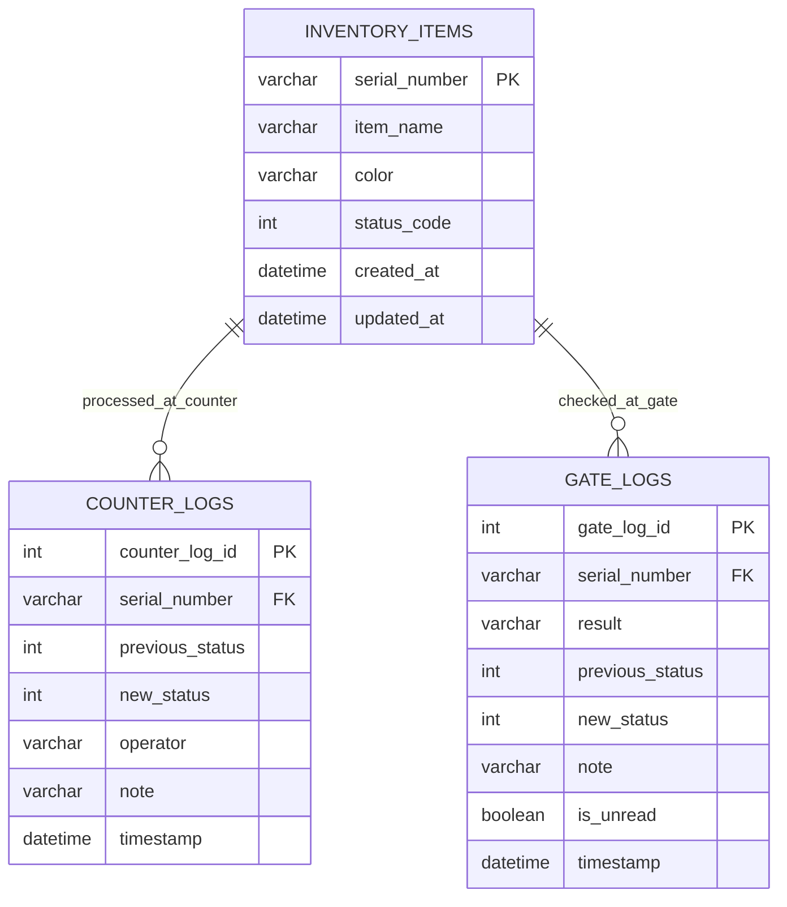

# 第五版本 E 架構說明

## 總說

第五版本 E 把系統重心放回「單件物品追蹤」。

和版本 D 最大的差異是：

- 不再只看同種物品總量
- 每件物品都有自己的流水號
- 正常流程與異常流程都只處理單一流水號
- 庫存彙總改成由主表即時計算 group 結果

這個版本真正要解決的問題是：

1. 每一件物品目前是庫存中、已售出還是未授權
2. 櫃檯與閘門各自留下什麼事件
3. 依照物件名稱與顏色分組時，整體數量分布是什麼

---

## 一、狀態碼規則

### `status_code = 0`

- 庫存中
- 代表物品尚未經過櫃檯正常出貨流程

### `status_code = 1`

- 已售出
- 代表物品已經經過櫃檯處理

### `status_code = 2`

- 未授權
- 代表物品在未經櫃檯正常處理的情況下，直接被閘門掃到

所有新建物品預設都是：

- `0`

---

## 二、主要資料表

### 1. `inventory_items`

這是主表，每一筆都代表一件真實單品。

必備欄位：

- `serial_number`：流水號，主鍵
- `item_name`：物件名稱
- `color`：顏色
- `status_code`：狀態碼

這張表的重點是：

- 物品不是用總數存在，而是一件一件存在
- 如果一次建立多件，系統會幫你產生多個不同流水號
- 但 `item_name` 和 `color` 可以相同

### 2. `counter_logs`

這是櫃檯日記。

用途：

- 記錄哪個流水號在櫃檯被處理
- 記錄狀態是怎麼從 `0` 變成 `1`

主要欄位：

- `counter_log_id`
- `serial_number`
- `previous_status`
- `new_status`
- `operator`
- `note`
- `timestamp`

### 3. `gate_logs`

這是閘門日記。

用途：

- 記錄哪個流水號經過閘門
- 判斷這次是正常出貨還是異常出貨

主要欄位：

- `gate_log_id`
- `serial_number`
- `result`
- `previous_status`
- `new_status`
- `note`
- `is_unread`
- `timestamp`

---

## 三、正常流程

### 步驟 1：櫃檯處理

櫃檯輸入某個流水號。

如果該物品目前是：

- `status_code = 0`

系統就會：

- 把它改成 `1`
- 寫一筆櫃檯日記

### 步驟 2：閘門確認

同一個流水號再經過閘門。

閘門會檢查：

- 目前狀態是不是 `1`

如果是：

- 判定為 `authorized`
- 狀態維持 `1`
- 寫一筆正常的閘門日記

---

## 四、異常流程

如果物品沒有先經櫃檯，
也就是它還是：

- `status_code = 0`

卻直接經過閘門，
系統就會：

1. 判定這次是 `unauthorized`
2. 把狀態改成 `2`
3. 寫一筆未授權閘門日記
4. 將 `is_unread = true`

所以異常流程的核心是：

- 閘門看到一件仍是庫存中的東西，卻企圖離開

---

## 五、未讀提醒

每次產生未授權閘門日記時：

- 主頁「未授權事件」卡片會出現 `!`

當使用者點進未授權事件詳情頁後：

- 系統會把相關未讀的 `gate_logs.is_unread` 改成 `false`

也就是：

- 驚嘆號只代表「你還沒看過這批異常閘門事件」

---

## 六、庫存彙總

雖然主表是逐件紀錄，
但系統還需要一個較高層的統計視角。

所以版本 E 會另外做：

- 依 `item_name + color` 分組

統計結果包含：

- `total_count`
- `in_stock_count`
- `sold_count`
- `unauthorized_count`

這不是獨立資料表，
而是透過主表即時計算出來的 grouped result。

---

## 七、Schema Mermaid

---

## 八、為什麼這版適合你現在的需求

這版最符合你現在的規則，因為：

1. 每件物品都有自己獨立的流水號
2. 櫃檯與閘門的角色完全分開
3. 正常流程和異常流程非常直觀
4. 主表與日記表結構都簡單
5. 同時保留了單件追蹤與 grouped 庫存報表
